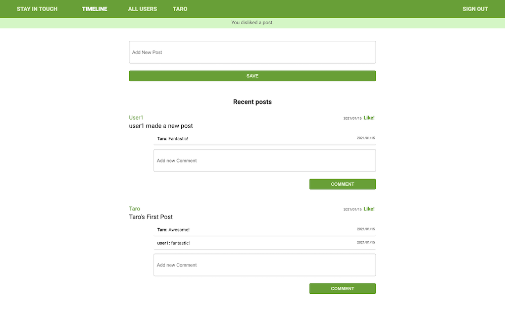

# Social media website

## About the Project

This project is social media app called “Stay in touch”.
Users can do the following actions:

As a guest user:
- Create account/log in
- See only “Sign in” and “Sign out” page

As a logged-in user:
- See all users list
- See selected user page with their user name and all posts written by them (the most recent posts on the top)
- Send a friendship invitation
- See a button “Invite to friendship” next to the name of user who is not my friend yet - on both users’ list and single user page
- See pending friendship invitations sent to me from other users
- Accept or reject friendships invitation
- Create new posts (text only)
- Like/dislike posts (but I can like single post only once)
- Add comments to posts
- See “Timeline” page with posts (with number of likes and comments) written by me and all my friends (the most recent posts on the top)
- Timeline page should be the root page of the app

A list of commonly used resources that I find helpful is listed in the acknowledgments.

## Table of Contents

* [About the Project](#about-the-project)
* [Built With](#built-with)
* [Live Demo](#live-demo)
* [Getting Started](#getting-started)
* [Authors](#authors)
* [Contributing](#contributing)
* [Show your support](#show-your-support)
* [License](#license)
* [Acknowledgements](#acknowledgements)

## Built With

* [Ruby on Rails](https://rubyonrails.org/)
* [Ruby](https://www.ruby-lang.org/en/)
* [HTML5](https://en.wikipedia.org/wiki/HTML5)
* [SASS(SCSS)](https://sass-lang.com/)
* [JavaScript](https://en.wikipedia.org/wiki/JavaScript)

## Live Demo

[Live Demo Link](https://mv-ror-social-media.herokuapp.com/)

## Getting Started

To get a local copy up and running follow these simple example steps.

1. On the project GitHub page, navigate to the main page of the repository.
2. Under the repository name, locate and click on a green button named `Code`. 
3. Copy the project URL as displayed.
4. If you're running the Windows Operating System, open your command prompt. On Linux, Open your terminal. 
5. Change the current working directory to the location where you want the cloned directory to be made. Leave as it is if the current location is where you want the project to be. 
6. Type git clone, and then paste the URL you copied in Step 3.  
e.g. $ git clone https://github.com/yourUsername/yourProjectName 
7. Press Enter. Your local copy will be created. 

## Authors

👤 **Binyam Hailemeskel**

- GitHub: [@bini-i](https://github.com/bini-i)
- Twitter: [@binyamshewa](https://twitter.com/binyamshewa)
- LinkedIn: [binyam hailemeskel](https://www.linkedin.com/in/bini-i/)

👤 **Yoko Saka**

- GitHub: [@yocosaka](https://github.com/yocosaka)
- Twitter: [@yocosaka](https://twitter.com/yocosaka)
- LinkedIn: [Yoko Saka](https://www.linkedin.com/in/yokosaka)

## Contributing

Contributions, issues, and feature requests are welcome!
Feel free to check the [issues page](../../issues).

1. Fork the Project
2. Create your Feature Branch (`git checkout -b feature/AmazingFeature`)
3. Commit your Changes (`git commit -m 'Add some AmazingFeature'`)
4. Push to the Branch (`git push origin feature/AmazingFeature`)
5. Open a Pull Request

## Show your support

Give a ⭐️ if you like this project!

## License

This project is [MIT](./LICENSE) licensed.

## Acknowledgements
* [devise gem](https://github.com/heartcombo/devise)
* [rspec rails gem](https://github.com/rspec/rspec-rails)
* [shoulda matchers gem](https://github.com/thoughtbot/shoulda-matchers)
